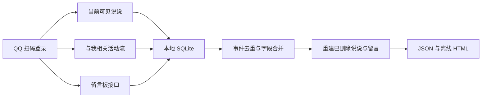

# 项目 006：QQ 空间历史恢复与本地归档

[English](README.en.md) · [上游版本说明](UPSTREAM.md) · [原始项目说明](README.upstream.md) · [快速使用](quickStart.md)

这是一个面向个人 QQ 空间数据备份的本地恢复工具。程序通过 QQ 官方扫码登录流程获取当前用户授权的 Cookie，从“当前可见说说”“与我相关”活动记录和留言板三个来源采集数据，再将仍留在活动流中的点赞、评论、浏览、转发和留言痕迹聚合为可浏览的历史记录。

本仓库是百个项目计划中的 Project 006，基于 [ZHChen2000/qzone-history](https://github.com/ZHChen2000/qzone-history) 的提交 `666f8dd4e7fb3ad88248f7818e2f95c16f48adb6` 整理。原项目采用 Apache License 2.0；本仓库完整保留许可证、上游作者信息和原始说明。

## 普通用户：下载后直接使用

不需要安装 Go、Python 或 Node.js。推荐下载 Release 中的 Windows ZIP，解压后直接双击 EXE。

1. 下载 [Windows ZIP（推荐）](https://github.com/wilderjett250-art/006-qzone-history-recovery/releases/download/v0.0.4/qzone-history-gui-windows-x64-v0.0.4.zip)；也可以单独下载 [Windows EXE](https://github.com/wilderjett250-art/006-qzone-history-recovery/releases/download/v0.0.4/qzone-history-gui-windows-x64-v0.0.4.exe)。
2. 如果下载的是 ZIP，右键选择“解压全部”，打开解压后的文件夹。
3. 双击 `qzone-history-gui.exe`，浏览器会自动打开工具页面。
4. 点击“获取/刷新二维码”，用手机 QQ 扫码并确认登录。
5. 选择想查看的年份和扫描范围，点击开始恢复。
6. 完成后点击页面里的结果入口，或在 EXE 所在文件夹中打开生成的 `_view.html` 文件。

Windows 第一次运行可能显示“未知发布者”提示。请确认文件来自本仓库的 Release，再选择“更多信息 → 仍要运行”。

本工具只用于本人或已获得明确授权的 QQ 空间。`session.db`、`app.db`、`*_export.json`、`*_activities.json` 和 `*_view.html` 都可能包含个人账号或空间内容，请不要上传或转发。

## 核心能力

- QQ 扫码登录，Cookie 和会话数据库仅保存在本机。
- 导入当前仍可见的说说和留言板记录。
- 深度扫描“与我相关”活动流，支持较大 Offset 和目标年份。
- 从点赞、评论、浏览、转发等事件碎片重建已删除说说。
- 将留言板 API 数据与活动流中的留言痕迹合并去重。
- 输出完整 JSON、原始活动 JSON 和离线 HTML 时间线。
- 通过本机 Web 控制台查看日志、活动数量、最早日期和恢复进度。

## 工作原理



活动流不是说说数据库的完整副本，而是一组事件证据。某条说说即使已经删除，它曾经产生的点赞、评论、浏览或转发事件仍可能保留正文片段、发送者、接收者和时间。程序采用多条路径交叉恢复：

1. 从最新活动开始连续分页，建立近期数据基线。
2. 使用稀疏 Offset 快速定位较早活动区段。
3. 对经验上容易出现断层的区间进行更小步长的重叠细扫。
4. 按半年时间窗查询，补充 Offset 跳变导致的遗漏。
5. 尝试不同 `set`、`scope` 参数和旧版 `feeds3` 时间游标。
6. 将所有入口得到的活动统一去重，再聚合正文、时间、图片、点赞、浏览和评论。

Offset 与年份不是线性关系。删除记录、权限变化和 feed 断层都会改变位置分布，因此推荐值只作为起点，最终应以控制台显示的“最早日期”为准。

## 目录结构

```text
cmd/                                  程序入口与诊断工具
internal/delivery/                    恢复流水线、依赖装配和本机 Web 控制台
internal/infrastructure/qzone_api/    QQ 空间请求、活动深扫和响应解析
internal/usecase/                     活动保存、说说及留言重建
internal/domain/                      领域实体、仓储和用例接口
pkg/database/                         SQLite 数据库与迁移
pkg/export/                           JSON、HTML 导出
pkg/offset/                           Offset 推荐和耗时估算
pkg/qrcode/                           QQ 登录二维码
config/                               默认本地配置
scripts/                              Windows 构建脚本
```

## 从源码构建

仓库的 `go.mod` 指定 Go `1.25.2`。进入项目目录后执行：

```powershell
go mod verify
go test ./...
go vet ./...
go build -ldflags="-H windowsgui -s -w -X qzone-history/version.Version=v0.0.4" -o qzone-history-gui.exe ./cmd/main.go
```

源码仓库不把 EXE 混在源码提交中；可直接使用的 Windows EXE 和 ZIP 已放在 Release，普通用户无需自行安装开发环境或编译源码。

## 使用方法

1. 运行自行编译的 `qzone-history-gui.exe`。
2. 浏览器打开 `http://127.0.0.1:17890`。
3. 点击“获取/刷新二维码”，用手机 QQ 扫码并确认。
4. 选择目标年份和 Max Offset，开始恢复。
5. 根据控制台的活动数量和最早日期判断是否需要继续调大 Offset。

常用经验起点：

| 目标年份 | 建议 Max Offset |
| --- | ---: |
| 2020 | 8,000 |
| 2018 | 18,000 |
| 2015 | 50,000 |
| 2014 及更早 | 80,000 起 |

更完整的年份对照、耗时估计和界面操作见 [quickStart.md](quickStart.md)。

## 本地输出

程序运行后会在可执行文件目录生成：

```text
session.db                 QQ 登录会话
{QQ号}/app.db              本地恢复数据库
{QQ号}/{QQ号}_export.json
{QQ号}/{QQ号}_activities.json
{QQ号}/{QQ号}_view.html
```

这些文件包含个人账号、Cookie 或空间内容，均已通过 `.gitignore` 排除，不会进入源码仓库。

## 本版本整理内容

- 从上游提交 `666f8dd4…` 建立干净源码基线。
- 排除上游预编译 EXE、本机会话数据库和个人 QQ 数据目录。
- 在扫描策略、活动去重、时间推断、数据重建、Offset 推荐和 GUI 生命周期处增加中文原理注释。
- 增加中英文项目说明和明确的安全边界。
- 保留 Apache License 2.0、上游作者信息、原始 README 和 quickStart。

## 验证记录

- `go mod verify`：通过。
- `go test ./...`：通过。
- `go vet ./...`：通过。
- 高置信度密钥扫描：未发现私钥、云访问密钥或 GitHub Token。
- 发布仓库不包含 EXE、`session.db`、用户数据库或 QQ 导出文件。

## 使用边界

本工具只用于备份本人或已获得明确授权的 QQ 空间数据。请求会访问 QQ 空间网页内部接口，深度扫描会产生较多请求，应合理设置 Offset 并遵守腾讯相关服务条款。

## 上游与许可证

- 上游项目：[ZHChen2000/qzone-history](https://github.com/ZHChen2000/qzone-history)
- 上游作者：ZHChen
- 上游基线：`666f8dd4e7fb3ad88248f7818e2f95c16f48adb6`
- 许可证：[Apache License 2.0](LICENSE)

本仓库的注释和文档整理不改变上游项目的作者归属。
