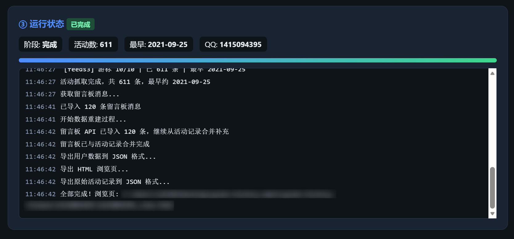
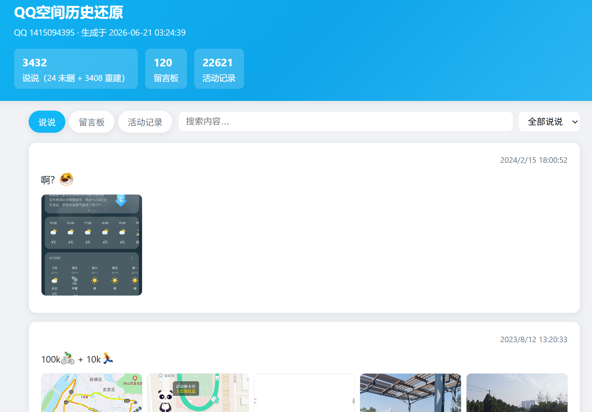

<div align="center">

# QQ 空间历史恢复工具（**Qzone-History**）


[](version/version.go)
[](LICENSE)
[](https://go.dev/)
[](#从源码编译)
[](https://github.com/ZHChen2000/qzone-history)

<br>

从QQ空间「与我相关」活动记录、说说接口、留言板接口中，尽可能恢复**已删除的说说与留言**，<br>
并导出为本地JSON与HTML浏览页。

<sub>仅供个人备份QQ空间数据 · 请遵守<strong>腾讯相关服务条款</strong></sub>

</div>

---

## 界面预览

双击 `qzone-history-gui.exe` 后，浏览器自动打开 Web 控制台，扫码登录即可开始恢复：

<p align="center">
  
</p>

实时日志与抓取进度：

<p align="center">
  
</p>

恢复完成后，在本地 HTML 浏览页按时间线查看说说、留言与活动记录：

<p align="center">
  
</p>

---

## 功能特性

- QQ 扫码登录（官方登录流程，Cookie 仅存本机）
- Web 控制台：实时日志、进度、可停止 / 可退出进程
- 按目标年份推荐 Max Offset，支持手动调大深扫
- 恢复未删除说说、从活动记录重建已删说说
- 留言板 API 拉取，失败时从活动记录重建
- 导出 `{QQ}_export.json`、`{QQ}_activities.json`、`{QQ}_view.html`

## 快速上手

**不想编译？** 直接双击目录中的 `qzone-history-gui.exe`，按**quickStart.md**操作即可。

详细步骤、Offset 对照表、耗时预估、常见问题见[quickStart.md](./quickStart.md)

## 目录结构

```
qzone-history/
├── qzone-history-gui.exe   # Windows预编译
├── docs/images/            # 文档配图
├── cmd/                    # 入口与调试工具
├── internal/               # 业务逻辑、GUI、API客户端
├── pkg/                    # 导出、路径、日志等公共包
├── config/                 # 默认配置
├── version/                # 版本与作者信息
├── go.mod
├── README.md
└── quickStart.md
```

## 从源码编译

需要 [Go 1.21+](https://go.dev/dl/)。

```powershell
# 分发，与仓库根目录预编译包相同
go build -ldflags="-H windowsgui -s -w -X qzone-history/version.Version=v0.0.4" -o qzone-history-gui.exe ./cmd/main.go

# 控制台
go build -o qzone-history.exe ./cmd/main.go
```

发布维护者可用 `scripts/build-release.ps1` 一键编译根目录 `qzone-history-gui.exe`（版本号自动读取 `version/version.go`），**每次功能更新请同步提交源码与预编译 exe。**

## 技术说明

本工具**不是**腾讯开放平台正式 API，而是模拟浏览器访问 QQ 空间网页版使用的内部接口（与你在浏览器中打开空间类似），请求带登录 Cookie 与浏览器请求头，并在抓取时做间隔限速。

- 数据**仅保存在本机** exe 同目录，不上传任何第三方服务器
- 深扫（大 Offset）会产生较多请求，请合理设置参数，自行承担使用风险

## 开源协议

本项目采用 [Apache License 2.0](LICENSE)。

## 免责声明

本工具仅供学习与个人数据备份。请勿用于未授权访问他人空间、商用爬取或其他违法行为。使用本工具所产生的一切后果由使用者自行承担。

---

<div align="center">

**作者：[ZHChen](https://github.com/ZHChen2000)** &nbsp;·&nbsp; **联系：QQ 1415094395**

</div>
