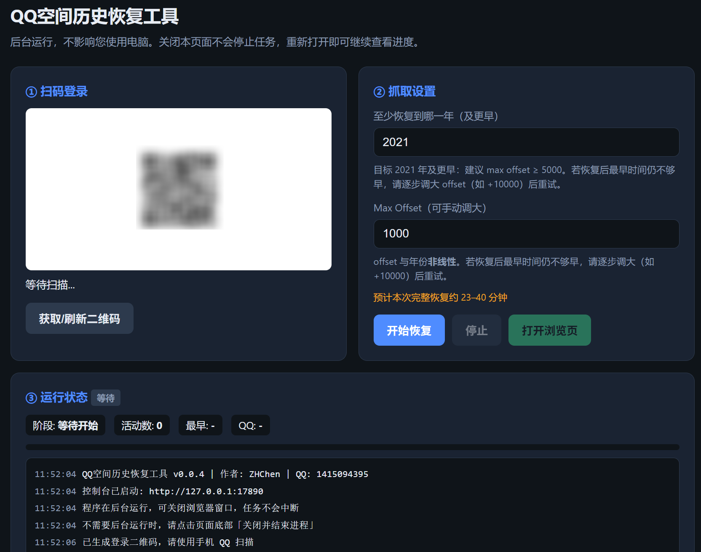

# 006 QQ 空间历史恢复工具 / Qzone History Recovery Tool

> 在用户授权的前提下，从 QQ 空间活动记录整理可追溯的历史内容并导出本地文件。
>
> **English:** With user authorization, organizes traceable Qzone activity history and exports it to local files.

## 解决什么问题 / Problem

当前页面只展示部分内容，删除说说难以从活动记录追溯，历史资料也不容易离线保存。

**English:** The current page may show only part of the history, while deleted posts are difficult to trace and archive offline.

## 项目展示 / Demo

启动桌面程序、扫码登录、选择年份和范围，最后导出 JSON 或离线 HTML。

项目把登录、扫描、去重、重建和导出收拢到一个 Windows 工作流。

**English:** Login, scanning, deduplication, reconstruction, and export are joined into one Windows workflow.

## 高光亮点 / Highlights

- Windows EXE，普通用户可双击启动。
  **English:** A Windows EXE that ordinary users can launch by double-clicking.
- 活动流深度扫描与时间范围定位。
  **English:** Deep activity scanning with time-range targeting.
- 点赞、评论、浏览、转发事件聚合与去重。
  **English:** Aggregates and deduplicates likes, comments, views, and repost events.
- JSON 与离线 HTML 双格式导出。
  **English:** Exports both JSON and offline HTML.

## 技术名词 / Tech

`Go · SQLite · Local Web UI · HTML · QQ Space interfaces`

## 从 ZIP 开始复现 / Reproduce from ZIP

1. 从 Release 下载 ZIP 并完整解压。
2. 双击 `qzone-history-gui.exe`。
3. 点击“获取/刷新二维码”，使用自己的手机 QQ 扫码并确认。
4. 选择年份和扫描范围，完成后在输出目录查看 JSON/HTML。

**Expected result:** 完成上述步骤后，应能看到项目的页面、窗口、设备输出或测试结果。

**Expected result:** After these steps, you should see the project's page, window, device output, or test result.

## 范围与安全 / Scope and Safety

这是基于公开项目整理的本地交付版本，不宣称原始项目原创；只处理自己有权访问和保存的 QQ 空间数据。

**English:** This is a localized delivery based on an open-source project, not a claim of original authorship; process only Qzone data you are authorized to access and save.

## 交流 / Contact

欢迎交流技术。

Open to technical exchange.

[English full version](README.en.md)
